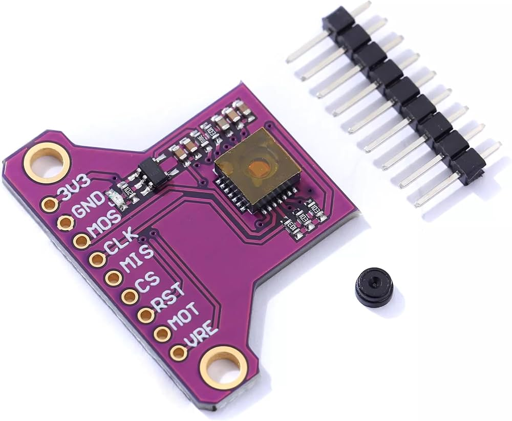
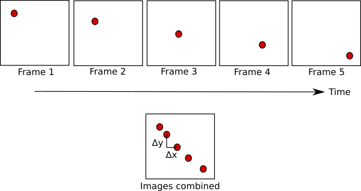

# Optical_Flow_Sensor
Repo For Optical Flow Sensor

The ROS 2 Optical Flow Sensor package provides **real-time motion estimation** by analyzing the **displacement of visual features between consecutive camera frames**. Using computer vision techniques implemented with OpenCV, the package calculates optical flow vectors and publishes the resulting motion estimates as ROS 2 topics.

Optical flow is widely used in robotics to estimate the relative movement of a robot or camera without relying solely on GPS or wheel encoders. This package can be integrated into mobile robots, drones, autonomous vehicles, and research platforms requiring visual motion estimation.

***How to use it:*** 

The functionality of an optical flow sensor of course depends on being able to **find features to track**, a surface that is very uniform will be hard to track since all the frames will look the same. If you’ve ever tried using a mouse on a glass table or reflective surface you’ve probably seen that it doesn’t work.

## How it works : 

The magic behind these sensors lies in their ability to analyze changes in the visual field. By comparing consecutive frames captured by the sensor’s camera, the system identifies distinct features and tracks their movement. This tracking process allows the sensor to calculate the velocity and direction of these features, which are then used to estimate the overall motion of the device. 

The sensor’s output is typically a set of vectors representing the direction and magnitude of the motion detected. This data can be further processed to provide more advanced information, such as the device’s altitude, orientation, and even its proximity to obstacles. 

## Factors Affecting the Sensor : 

The sensor’s effectiveness depends on several factors, including : 

1- the quality of the camera.

2- the processing algorithms used, and the environmental conditions.

3- poor lighting or rapid changes in the scene can introduce noise and inaccuracies in the sensor’s output(We use a light rall to make good lighting).

## Installing the Packages : 

